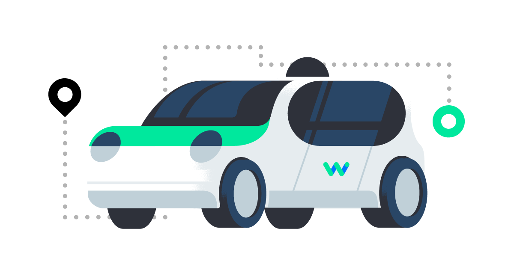
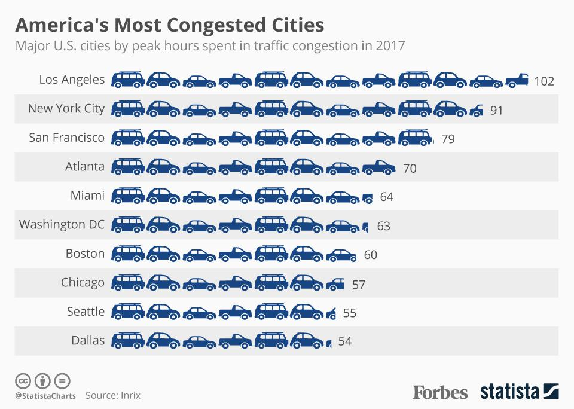

Most people are uncomfortable with change. Some are _especially_ uncomfortable with the idea of automation (robots/software replacing humans). Despite the fact that machines and software continue to increase our standard of living, most people still do not trust machines to perform the work that humans currently do. Recent [surveys](https://saferoads.org/wp-content/uploads/2020/01/AV-Public-Opinion-Polls-7-22-19.pdf) show:

- 64% of Americans would _not_ buy a self-driving car
- 71% of U.S. drivers would be _afraid_ to ride in a fully self-driving vehicle

Despite the incredible work by engineers and other scientists, corporations have been unable to convince a majority of the population of the immense benefits of self-driving vehicles. Tesla, Google, and Waymo are among the leaders in self-driving technology; they spend lots of time and resources presenting their hardware and software to the public. Still, many Americans do not trust autonomous vehicles.

To an extent, these fears are understandable. Watching a car cruise around the road with no driver is unsettling. What happens if a young child runs into the road? Can we trust software to swerve out of the way and not hit other pedestrians? What if the software contains a bug and my car drives off a bridge?

Those are all valid concerns, but they are ones that have _already been solved_ by the self-driving community. Even in its infancy, autonomous vehicles (AVs) have proven themselves to drive safer than the average human  - and they will only get safer and more efficient.

In this post, I’ll discuss:

1. Humans are unsafe and untrustworthy drivers
2. Self-driving cars are currently safer than humans
3. Autonomous vehicles will make roads safer and less congested
4. Self-driving cars will only become safer and offer more luxurious riding experiences

`I am not arguing that we ban cars.`

State and federal governments should leave individuals and businesses free to persue any mode of transportation they desire - autonomous or not.

This discussion focuses on why robots and software are superior drivers and why we should embrace a transition to autonomous driving. A rational society is one that continues to improve its standard of living. Self-driving vehicles are a step in that direction.

Before diving into AVs, why should we even care about vehicle safety at all? Aren't we driving sophisticated cars already?

# Humans Are Dangerous Drivers

Before discussing self-driving cars, we should briefly talk about the obvious: **humans are bad drivers.** Human drivers kill 30,000 - 40,000 people [each year](https://en.wikipedia.org/wiki/Motor_vehicle_fatality_rate_in_U.S._by_year). That means ~96 Americans perish every day in auto accidents. In the time you’ve taken to read this paragraph, someone has died in a car crash.

I don’t mean to be morbid - this is the reality of vehicles. Despite their enormous convenience, many people drive them in precarious ways, endangering everyone around them. Although we have become [far better](https://injuryfacts.nsc.org/motor-vehicle/historical-fatality-trends/deaths-and-rates/) drivers over the years, humans are still far too unreliable and risky for what our standards of safety should be.

I consider people as dangerous drivers because:

1. Humans often drive distracted
2. Human vision is sensitive and flawed; sun and rain can impair vision
3. Humans become sleepy which significantly impairs driving capability
4. Humans might drive under the influence of alcohol and other drugs which significantly impair brain and motor functions
5. Humans are emotional which may cause them to make irrational, snap decisions while driving (road rage)

Most people try to drive safely and do not intend to hurt anyone on the road. But humans are fallible and will occasionally make mistakes. And making a mistake while driving a two ton metal cage can cause serious problems.

Until recently, humans were the only things remotely capable of controlling a vehicle. But the advent of software and machine learning have afforded us the ability to create sophisticated machines capable of driving vehicles better than we ever could.

# Autonomous Vehicles Are Safe

Despite how young self-driving vehicles are, we have a plethora of data to analyze. [Tesla](https://www.tesla.com/VehicleSafetyReport#:~:text=had%20Autopilot%20engaged.-,For%20those%20driving%20without%20Autopilot%20but%20with%20our%20active%20safety,every%201.26%20million%20miles%20driven.) and [Waymo](https://waymo.com/safety/) are the leaders 
in autonomous vehicle data.

Tesla and Waymo and are the leaders in autonomous vehicle data. Tesla has [accumulated](https://electrek.co/2020/04/22/tesla-autopilot-data-3-billion-miles/) over **3 billion miles** in Autopilot mode since 2014. Waymo has [tested](https://www.cnet.com/news/waymo-driverless-cars-have-driven-20-million-miles-on-public-roads/) its vehicles by driving **over 20 million miles** on public roads and tens of billions of miles in simulation. 

Americans [drive](https://www.rand.org/content/dam/rand/pubs/research_reports/RR1400/RR1478/RAND_RR1478.pdf) a cumulative 3 trillion miles annually, so autonomous vehicle companies have some catching up to do. Nonetheless, we are in a position to begin comparing robot drivers to humans.

In the most recent quarter, [Tesla’s](https://www.tesla.com/VehicleSafetyReport) autonomous vehicles were **~10x safer** than the average driver. Here is a snippet from their most recent safety report:

> In the 3rd quarter, we registered _one accident for every 4.59 million miles driven in which drivers had Autopilot engaged_ [emphasis mine]. For those driving without
> Autopilot but with our active safety features, we registered one accident for every 2.42 million miles driven. For those driving without Autopilot and 
> without our active safety features, we registered one accident for every 1.79 million miles driven. By comparison, NHTSA’s most recent data shows that
> _in the United States there is an automobile crash every 479,000 miles_.

Waymo’s [results](https://storage.googleapis.com/sdc-prod/v1/safety-report/Waymo-Public-Road-Safety-Performance-Data.pdf) are equally impressive. In over 6.1 million miles of automated driving (roughly 500 years worth of driving for one person), Waymo’s self-driving vehicles were involved in 18 contact events - none of which resulted in serious injury. Many of these “contact events” were fender-benders or sideswipes due to improper lane changes or failure to yield.

Self-driving cars have one mission: focus on the road. Every sensor and line of code has a purpose. Robot drivers are not susceptible to road rage, emotional distraction, or sandwich-eating. Autonomous vehicles need not adjust their seatbelt, talk on the phone with their friend, or drive drunk.

Herein lies the major reason why robots are superior drivers: _they focus entirely on the road and its conditions_, whereas humans typically do not. Their sole existence is to focus on the road, ingest data from the various sensors, and make the most informed driving decision possible.

Robot drivers are defensive and cautious _by design._ Humans, to put it mildly, are often less than cautious on the road. Although we may try to drive cautiously, people do not always have the discipline to control their emotions while behind the wheel.

This is not to imply that self-driving vehicles are perfect. There are some major problems that engineers are working to solve, including:

- _Perception_: how can we be confident that AVs are seeing _everything_?
- _Redundancy_: what happens if one or more sensors fail?
- _Security_: how can we prevent people from hacking AVs?

Those are legitimate questions - ones that engineers will continue to work on for years. I may even discuss those issues in subsequent posts becuase they are interesting problems to explore. But what’s important for this discussion is to understand that self-driving vehicles, while a significant improvement over human drivers, are not perfect and face unique challenges.

Despite the challenges facing AV engineers, data shows impressive safety improvements over human drivers. Not only will AVs save lives - they will drastically improve our driving experience.

# AVs Will Decrease Accidents and Congestion

Self-driving vehicles will make our roads safer and less congested. Americans spend an average of **54 hours per year sitting in traffic** [[source]](https://static.tti.tamu.edu/tti.tamu.edu/documents/mobility-report-2019.pdf). Not 54 hours driving, but sitting still. Idling vehicles waste gallons of fuel. The aforementioned source estimates that Americans waste over **3 billion gallons of fuel** because of traffic congestion. Those commuting in large cities spend _multiple days out of their year_ waiting in traffic. 

Car accidents are the major contributor to congestion. On highways and interstates, a single two-car accident can halt traffic for hours. Autonomous vehicles will substantially reduce the number of hours we spend in traffic because those vehicles will experience significantly less accidents. Self-driving cars will also reduce the number of erratic lane-changes made by humans which cause the dreaded [traffic shockwaves](https://en.wikipedia.org/wiki/Traffic_wave).

# AVs Will Continue To Improve

We can now say with confidence that autonomous vehicles:

- are safer than the average human driver
- will decrease fatalities, injuries, and traffic congestion
- allow passengers to spend time relaxing or working instead of driving

Tesla, Waymo, [BMW](https://www.bmw.com/en/automotive-life/autonomous-driving.html), [Cruise](https://www.getcruise.com/), and many other companies are investing billions of dollars into the research and testing of autonomous vehicles. Machine learning and neural networks are not longer in the realm of science fiction either. Corporations such as [Amazon](https://aws.amazon.com/machine-learning/) have teams dedicated to building and training their networks, which in turn improves the performance of self-driving vehicles.

In fact, I believe we will soon look back on the times when humans drove cars and say: "What the hell were we thinking?"

I _eagerly_ await the day when robots drive all of our vehicles. That day will be a safer, calmer, and more enjoyable one to live in. Tens of thousands of lives will be spared, along with billions of gallons of gasoline saved. Instead of spending time focusing on the road, we will be able to relax, rest, or work in our vehicles while a team of software and machines handle the trivial tasks of accelerating, braking, and turning. 

The future of vehicle travel is a bright and beautiful one.